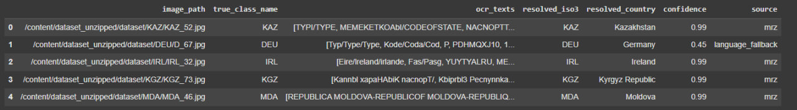

# Country Detection from Identity Documents

> ⚠️ **Disclaimer**
>
> Это тестовое сделано в сжатые сроки (пару часов), основные идеи не протестированы, о них далее, зато:
> - есть **рабочий прототип** с адекватной архитектурой;
> - подробно описаны **соображения/компромиссы**, почему выбран именно такой дизайн;
> - заложены **крючки для масштабирования** на сотни стран и документы **без MRZ**.

---

## TL;DR

- Вместо «наивной» image-classification по ISO-классам — **OCR-first** пайплайн:  
  **MRZ (жёстко)** → **мультиязычные алиасы стран (словарь + fuzzy)** → **языковой fallback**.
- Даёт explainable вывод и естественно переносится на **ID/driver licenses/voter cards**, где MRZ нет.
- В ноутбуке OCR гонялся на **CPU** (поэтому медленно), а также само решение далеко неоптимально.

---

## Почему **не** использовать Image Classification

**Image classifier (ResNet18 и прочее)**:
- ❌ Плохо обобщается на unseen классы (нужно переобучение под каждую новую страну)
- ❌ Хрупкость к стилю и внешнему виду документа (цветность, скан, освещение)
- ❌ MRZ и текстовая информация вообще игнорируются
- ✅ Может быть полезным как доп. модальность (например, для verification)

**OCR-first подход**:
- ✅ Позволяет "читать" стандартизированные текстовые признаки (MRZ, страна, язык, город и т.д.)
- ✅ Масштабируется: чтобы добавить страну, не надо переобучать модель
- ✅ Объясним: видим текст и знаем, почему и как было принято решение

---

## Архитектура пайплайна

```text
[Изображение документа]
       ↓
[Multilingual OCR (PaddleOCR 3.0)]
       ↓
[Raw текст из документа]
       ↓
[Country Resolver]:
    1. MRZ-разбор → ISO-код страны
    2. Fuzzy match: словарь названий стран на разных языках
    3. Language detection (langdetect → ISO-lang → plausible country)
       ↓
[Возвращаем: ISO3, ISO2, имя страны, confidence, источник]
```

---

## Выбор OCR

Используем [PaddleOCR 3.0](https://github.com/PaddlePaddle/PaddleOCR):
- Multilingual (80+ языков), без необходимости указывать язык
- Поддерживает обработку полной страницы сразу
- Хорошая интеграция в пайплайны (структурированный JSON, bounding boxes, текст)

OCR — самая дорогая операция, но при использовании GPU можно укладываться в адекватные рамки ().  
Также возможна замена на `MonkeyOCR`, `MiniCPM-o`, `SmolDocling` и др. — но это требует доп. интеграции.

---

## Как определяется страна

1. **MRZ zone**  
   - Регулярки по шаблонам `P<USA`, `IDFRA`, `XXX123456`
   - ISO-код достаётся напрямую
   - Если такой код не входит в классы (в список стран) — идём дальше

2. **Country aliases**  
   - Словарь названий стран на разных языках (напр., "Deutschland", "République Française", "Francia")
   - Поиск через `RapidFuzz` с настройкой threshold
   - Работает даже с OCR-ошибками (напр. `FRAHC` → `France`)

3. **Language fallback**  
   - Используем `langdetect` → ISO 639-1 → возможные страны
   - Например, `tr` → Turkey, `pl` → Poland
   - Даёт слабый сигнал, но полезен, если всё остальное не сработало

---

## Почему это решение масштабируется

- Документы без MRZ: алгоритм fallback'ов работает по языку + словам
- Новые страны: просто расширяем словарь
- ID-карты, водительские и прочее: архитектура не привязана к конкретной верстке паспорта
- Модель не "зашита" в fixed set стран — вся логика "в данных"

---

## Пример

```python
['BELGIE', 'BELGIQUE', 'BELGIEN', 'BELGIUM', ..., 'P<BELCAPP<<RAFAEL', '0XCS6N4RP0BEL3205057M2508197']
→ MRZ → BEL ✅
→ Aliases: "Belgium", "Belgique", ...
→ Langs: ["nl", "fr", "de"]
```


---

## Что можно улучшить (и как)

Ниже — **полезные апгрейды** по всем слоям пайплайна: от скорости и качества OCR до устойчивости, обобщения и прод-логики. 

---

### 1) Ускорение OCR (тот же стек, быстрее)

**Идея:** сохранить PaddleOCR, но выжать скорость за счёт инженерии.

- **ONNX / TensorRT для det/rec**  
  - *Что даёт:* ×1.5–×3 speed-up без потери качества.  
  - *Как:* экспорт детектора/распознавателя и запуск через onnxruntime-gpu / TRT.  
  - *Минусы:* сложность сборки/совместимости; прирост зависит от модели и размера.  
  - *Трейд-офф:* **скорость ↑↑**, **качество =**, **инженерия ↑**.

- **Двухпроходный режим (cascade)**  
  1) Быстрый прогон (меньше разрешение, высокий порог конфиденса).  
  2) Если страну не нашли — точный селективный прогон по ROI (верх/низ для хедера/MRZ).  
  - *Плюсы:* ускоряет p50, экономит GPU-время на лёгких кейсах.  
  - *Минусы:* добавляет ветвление логики; важно корректно выбирать ROI.  
  - *Трейд-офф:* **скорость p50 ↑**, **сложность ↑**, **качество =/↑**.

- **Агрессивная фильтрация боксов**  
  - Отсекаем очень мелкий текст, низкоуверенные боксы; MRZ и заголовки обычно крупные.  
  - *Трейд-офф:* **скорость ↑**, риск пропуска «тонкой» полезной инфы (качество немного ↓ на редких кейсах).

- **Dynamic resizing**  
  - Масштабировать вход не по «фиксированному max_side», а адаптивно (оценить плотность текста/размеры).  
  - *Трейд-офф:* **скорость ↑**, **стабильность** зависит от эвристики.

---

### 2) Замена/комбинация OCR-бэкендов

**Идея:** если PaddleOCR узкое место, попробовать альтернативы, сохранив интерфейс «строки → resolver».

- **docTR (DBNet + CRNN/SVTR)**  
  - *Плюсы:* PyTorch-экосистема, стабильный end-to-end, хорошая скорость/качество.  
  - *Минусы:* меньше «кустарных» оптимизаций, чем у Paddle; качество на экзотике надо проверять.  
  - *Трейд-офф:* **простота ↔ скорость**, **качество ≈**.

- **MMOCR (DBNet++/PAN + ABINet/SVTR/SAR)**  
  - *Плюсы:* гибкая комбинаторика det/rec, много SOTA компонентов.  
  - *Минусы:* выше порог входа; API меняется между версиями.  
  - *Трейд-офф:* **качество/скорость тюнингом**, **сложность ↑**.

- **EasyOCR / RapidOCR**  
  - *Плюсы:* быстрый старт, иногда бодрее на малых страницах.  
  - *Минусы:* качество хуже на сложных документах; меньше гибкости.  
  - *Трейд-офф:* **скорость и простота**, **качество ↓**.

*Практика:* оставить PaddleOCR как **основной**, а docTR/MMOCR — как **параллельный профиль** для A/B на проблемных типах документов.

---

### 3) VLM-fallback точечно (качество на сложных, но не всегда дешево)

**Идея:** подключать VLM-модель **только** когда OCR неуверен (нет MRZ/aliases).

- **Открытые VLM (Qwen-VL 2.5, Nanonets-OCR-s, SmolDocling и др.)**  
  - *Плюсы:* умеют вытаскивать структуру/колонтитулы, иногда читают хуже видимый текст лучше OCR.  
  - *Минусы:* генерация → latency и стоимость по токенам; возможны галлюцинации.  
  - *Как снизить цену:* узкий промпт («верни только MRZ и строку с названием страны»), `max_new_tokens` маленький, 4-бит квантизация.  
  - *Трейд-офф:* **качество на «грязных» кейсах ↑**, **скорость p95/стоимость ↓**, **сложность ↑**.

- **Политика включения:**  
  - «Сработать, если»: нет MRZ, alias-score < τ, мало строк, OCR-уверенность низкая.  
  - «Не сработать, если»: MRZ найден, alias-score высокий — нет смысла дергать VLM.

---

### 4) MRZ-robustness (качество и надёжность от OCR-ошибок)

**Идея:** сделать извлечение ISO-3 из MRZ устойчивым к типовым OCR-ошибкам.

- **Контекстная нормализация**  
  - Замены `O/0`, `I/1`, удаление «случайных» пробелов, допускаемые символы `[A-Z0-9<]`.  
  - *Трейд-офф:* **качество ↑**, риск редких ложных срабатываний минимален.

- **Checksum-валидация**  
  - Для номера документа/дат MRZ предусматривает контрольные суммы — можно проверять.  
  - *Трейд-офф:* **надёжность ↑**, **инженерия ↑**.

- **MRZ-локализация (layout-hint)**  
  - Лёгкая детекция области MRZ (низ страницы) и OCR только там — точнее и быстрее.  
  - *Трейд-офф:* **скорость/качество ↑**, **сложность ↑**.

---

### 5) Aliases: покрытие и точность (обобщение на сотни стран)

**Идея:** расширить и «почистить» мульти-язычный словарь стран.

- **Больше источников:** CLDR/Babel + PyCountry + Country Converter + Wikidata (экзонимы, исторические варианты, длинные официальные названия).  
- **Нормализация:** diacritics → ASCII, casefold, унификация пунктуации, **варианты разделителей** в длинных названиях.  
- **Fuzzy-метрики:** не только `token_set_ratio`, но и partial/token_sort, weighted vote.  
- **Disambiguation-правила:** UK/GB/Great Britain, Côte d’Ivoire/Ivory Coast, Korea DPR/ROK и пр.  
- *Трейд-офф:* **качество/coverage ↑**, **сложность словаря ↑**, риск редких конфликтов (лечится правилами и приоритетами).

---

### 6) Language fallback: сделать аккуратнее

**Идея:** лучше использовать язык как слабый сигнал.

- **Детекция по наборам строк**, исключая короткие токены и цифры.  
- **Голосование языков**: top-2/3, а не один; английский не даёт сигнала.  
- **Маппинг lang→страна** неоднозначен (es: ESP, MEX, ARG…). Можно:  
  - Ограничивать кандидатов **только теми, что есть в датасете**,  
  - Вводить **региональные подсказки** (топонимы, код ISO-2 из MRZ-подобных строк),  
  - Давать **низкую уверенность** (0.3–0.5) и использовать только при полном отсутствии MRZ/alias.  
- *Трейд-офф:* **robustness ↑**, но **решающей** эта ветка быть не должна.

---

### 7) Топонимы и гео-сигнал (качество в доках без MRZ/страны)

**Идея:** если документ — справка/удостоверение без явного country name, спасают города/регионы.

- **Geo-gazetteer (GeoNames/Wikidata)**  
  - Link слова → город/регион → страна; нормализовать через transliteration.  
  - *Плюсы:* даёт сильный сигнал в реальных документах.  
  - *Минусы:* словари большие, нужны фильтры по частоте и контексту (избежать «Москва» в рекламных текстах и т.п.).  
  - *Трейд-офф:* **качество ↑**, **инженерия ↑**.

---

### 8) Vision-prior / re-rank (когда текста мало)

**Идея:** embeddings по изображению как «второе мнение».

- **CLIP/SigLIP-эмбеддинги**  
  - Сравнивать с эталонными примерами стран/символик, делать re-rank top-N.  
  - *Плюсы:* помогает, когда текст оскудный/зашумлённый.  
  - *Минусы:* риск «залипнуть» на цветах/паттернах синтетики; требует аккуратного листа эталонов.  
  - *Трейд-офф:* **robustness ↑** на малотекстовых, **объяснимость ↓**.

---

### 9) Политика отказов и прод-логика

**Идея:** лучше `UNKNOWN`, чем уверенная галлюцинация.

- **Приоритеты:** `MRZ > alias >> lang > vision` (последние двое — подсказки).  
- **Пороги и tie-breakers:** если два сигнала конфликтуют, запрашиваем повтор/ручную проверку.  
- **Explainability:** логируем `source`, подробности сопоставления (MRZ-строка, alias-кандидаты, детектированный язык).  
- *Трейд-офф:* **качество прод-решений ↑**, **простота ↓**.

---

### Альтернативные стеки — когда стоит

| Подход | Когда применять | Плюсы | Минусы | Трейд-офф |
|---|---|---|---|---|
| **PaddleOCR (ядро)** | Базовая схема, скорость <1s | Стабильный, быстрый, мульти-язычный | Требует hands-on тюнинга | **Скорость/качество =**, **простота =** |
| **docTR/MMOCR** | Нужно больше гибкости/библиотек | Хороший баланс, PyTorch-экосистема | Интеграция/конфиги | **Качество/скорость ±**, **сложность ↑** |
| **VLM-fallback** | Сложные страницы/структура | Тянет структуру, иногда спасает | Латентность/стоимость, галлюцинации | **Качество p95 ↑**, **скорость/стоимость ↓** |
| **CLIP re-rank** | Текста мало, нужен prior | Помогает в gray-зонах | Может «залипать» на стиле | **Robustness ↑**, **объяснимость ↓** |

